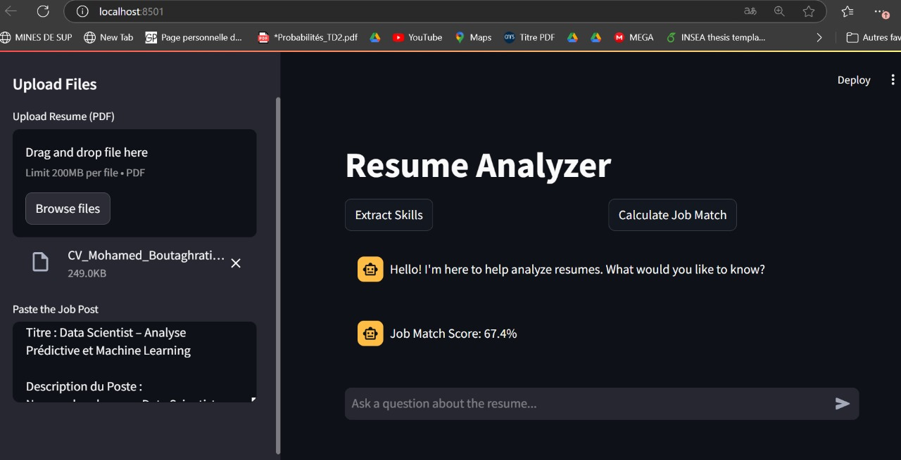

# Resume Analyzer AI Agent 🧠💼  

An intelligent **AI agent** designed to automate CV analysis and job matching, making the recruitment process efficient and personalized. This agent leverages **retrieval capabilities** (using vector embeddings) and **LLMs (Large Language Models)** for text generation to perform various tasks autonomously.  

---

## Features ✨  

1. **CV Analysis**  
   - Extracts key skills from resumes, including:  
     - **Technical skills**  
     - **Analytical skills**  
     - **Soft skills**  

   **Example Output:**  
   
   
3. **Job Matching**  
   - Calculates a **relevance score** between a CV and a job description using advanced similarity measures.

      **Example Output:**  
   

4. **User Interaction**  
   - **Answers questions** related to the resume, helping users understand their profile better.  
   - **Provides feedback** to improve or tailor the resume for specific roles.  
   - **Generates insightful questions** for users to refine their resumes further.

        **Example Output:**  
   

5. **Efficient Processing**  
   - Processes resumes in **PDF format** and supports **real-time queries** through a user-friendly interface.  

---

## How It Works 🚀  

1. **Embedding Model**  
   - Uses **HuggingFace Embeddings** (`sentence-transformers/all-mpnet-base-v2`) to create dense vector representations for resumes and job descriptions.  

2. **Large Language Model**  
   - Powered by **LLMs** like `llama-3.1-70b-versatile`, the agent generates insights, answers user queries, and categorizes skills.  

3. **Similarity Scoring**  
   - Computes **cosine similarity** between embedded vectors of resumes and job descriptions to determine the match percentage.  

4. **PDF Text Extraction**  
   - Extracts text from uploaded resumes using **PyPDF2** for seamless processing.  

---

## Technologies Used 🛠️  

- **LangChain** for building the agent’s workflow.  
- **HuggingFace Sentence Transformers** for vector embeddings.  
- **ChatGroq API** for LLM-based text generation.  
- **PyPDF2** for PDF handling.  
- **Streamlit** for an interactive user interface.  

---

